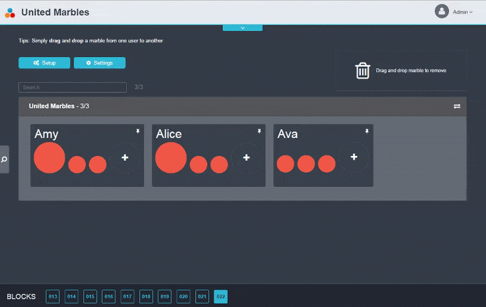
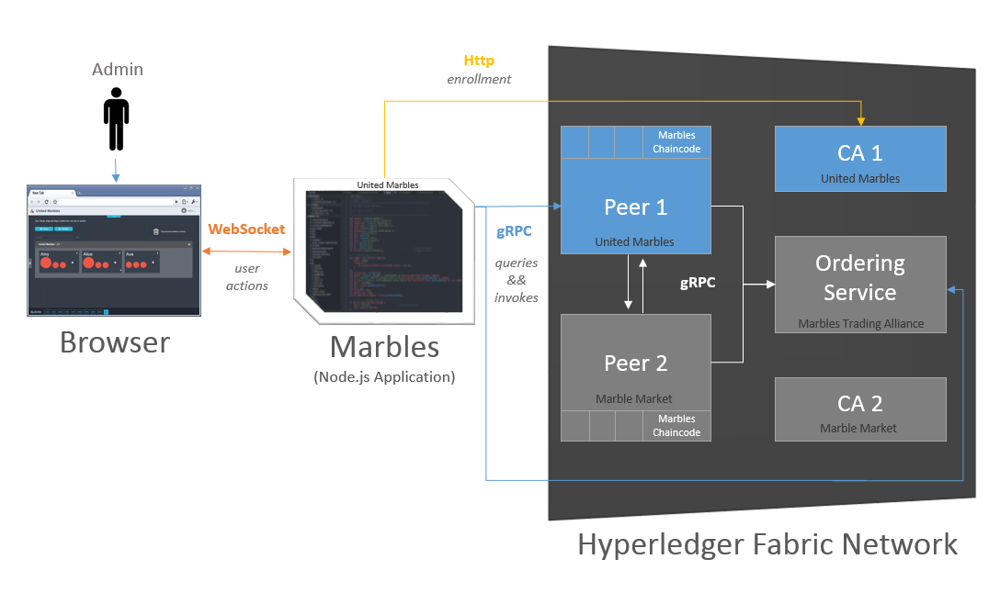
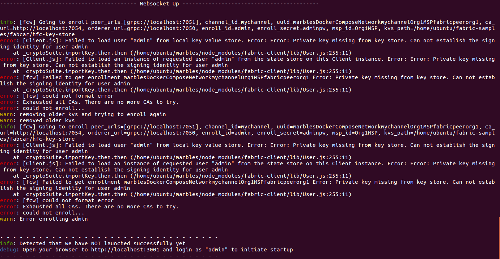
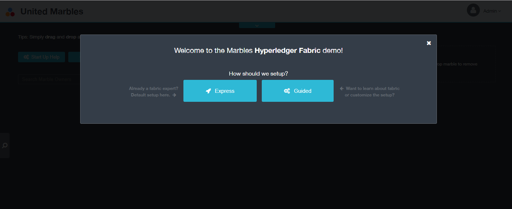
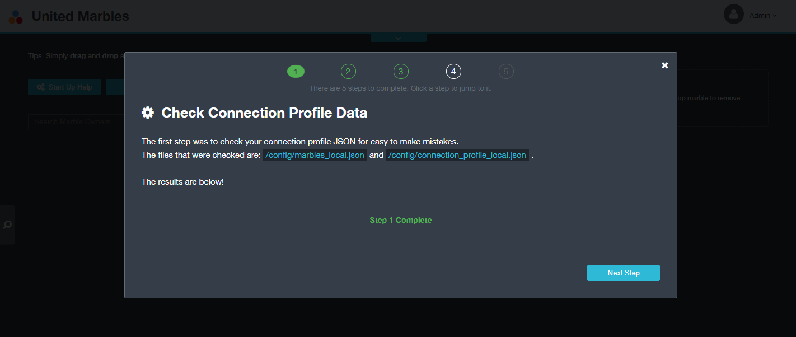
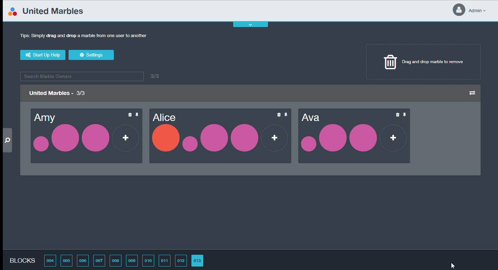

<!--more -->

<center></center>
## 前言

本教程基本上是对`Marbles`项目的翻译过程. 如果英文比较好的话，建议根据[官方操作说明](https://github.com/IBM-Blockchain/marbles/blob/master/README.md),一步步进行环境部署。当然你也可以参考本教程在自己的主机上部署该项目。

## Marbles 介绍

### 关于 Marbles

- 这个应用程序的基础网络是 [Hyperledger Fabric](https://github.com/hyperledger/fabric/)，后者是一个 `Linux Foundation` 项目。 您可能想查阅以下操作说明来稍微了解一下 `Hyperledger Fabric`
- 本演示旨在帮助开发人员了解链代码的基础知识以及如何使用 Fabric 网络开发应用程序
- 这是一个非常简单的资产转移演示。多个用户可以创建并相互转移弹珠。



### 版本

各种版本的 `marbles` 同时存在。 本版本兼容 `Hyperledger Fabric v1.1x`。 你可以通过检出别的分支来获取别的版本的 `marble`,这里演示使用的是`ae4e37d`分支

### 应用程序背景

请大家集中注意力，这个应用程序将演示如何利用  `Hyperledger Fabric` 在许多弹珠所有者之间转移弹珠。 我们将在 `Node.js` 中使用一些 `GoLang` 代码完成此任务。 该应用程序的后端将是在我们的区块链网络中运行的 `GoLang` 代码。 从现在开始，这些 `GoLang` 代码将称为“链代码”或“cc”。 该链代码本身会创建一颗弹珠，将它存储到链代码状态中。 该链代码本身可以将数据作为字符串存储在键/值对设置中。 因此，我们将字符串化 `JSON`对象，以便存储更复杂的结构.
>弹珠的属性包括：

- ID（唯一字符串，将用作键）
- 颜色（字符串，CSS 颜色名称）
- 尺寸（int，以毫米为单位）
- 所有者（字符串）

我们将创建一个用户界面，它可以设置这些值并将它们存储在区块链的账本中。 弹珠实际上是一个键值对。 键为弹珠 ID，值为一个包含（上面列出的）弹珠属性的 `JSON` 字符串。 与 `cc` 的交互是通过对网络上的一个对等节点使用 `gRPC` 协议来完成的。 `gRPC` 协议的细节由一个名为 [Hyperledger Fabric Client SDK](https://www.npmjs.com/package/fabric-client) 的 SDK 处理。 请查看下图了解拓扑结构细节。




#### 应用程序通信流

- 1.管理员将在他们的浏览器中与我们的 Node.js 应用程序 Marbles 进行交互
- 2.此客户端 JS 代码将打开一个与后端 Node.js 应用程序的 Websocket 连接,管理员与该站点交互时,客户端 JS 将消息发送到后端
- 3.读取或写入账本称为提案,这个提案由 Marbles (通过SDK)构建,然后发送到一个区块链对等节点.
- 4.该对等节点将与它的 Marbles 链代码容器进行通信. 链代码容器将运行/模拟该交易. 如果没有问题, 它会对该交易进行背书,并将其发回我们的Marbles程序.
- 5.然后, Marbles (通过SDK)将背书后的提案发送到订购服务.订购方将来自整个网络的许多提案打包到一个区块中. 然后它将新的区块广播到网络中的对等节点
- 6.最后,对等节点会验证该区块并将它写入到自己的账本中,该交易现在已经生效,所有后续读取都会反映此更改.

## Marbles 项目环境配置

这里使用的是本地的 Hyperledger Fabric 网络来部署项目,如果想使用 IBM Cloud IBM Blockchain 服务来部署该项目,请参考前言中给的官方文档.

- 注意:本教程使用的系统环境是: `ubuntu16.04`

### 设置 Chaincode(链码) 开发环境

如果您通过本人的上一篇博客[基于ubuntu16.04快速构建Hyperledger Fabric网络](http://dmego.me/2018/05/14/quick-start-hyperledger-fabric.html)已经搭建好了一个 Hyperledger Fabric 网络,那么这里只需要安装 Node.js 的环境并验证环境是否正确即可,如果您没有在本地搭建 Hyperledger Fabric 网络,建议您通过上述博客先在本地构建好网络环境.

#### 验证 Git 环境

一般来说 linux 系统都是自带 Git ,如果系统里没有装,可以使用如下命令来进行安装

```bash
sudo apt-get install git
```

安装完成后验证一下

```bash
$ git --version
git version 2.7.4
```

#### 验证 GO 环境

Go安装安装了一组Go CLI工具，这些工具在编写链接代码时非常有用。例如，该 go build 命令允许您在尝试将其部署到网络之前检查链代码是否实际编译.

- 验证安装环境

```bash
$ go version
go version go1.10 linux/amd64
$ echo $GOPATH
/home/ubuntu/go
```

这里的 ubuntu是我的用户名,表示我的 GOPATH  目录是我的主目录下的 go 文件夹,当然你的 GOPATH 不需要匹配上面的那个。它只是很重要的，但你必须把这个变量设置为文件系统上的有效目录.

#### 安装 Node.js 环境

首先可以先使用 `node -v` 和 `npm -v` 命令来验证系统中是否有 Node.js 环境,如果没有安装则需要使用如下命令进行安装:

```bash
sudo apt-get install nodejs
sudo apt install nodejs-legacy
sudo apt install npm
```

安装完成之后使用 `node -v` 和 `npm -v` 命令来查看版本信息:

```bash
$ node -v
v4.2.6
$ npm -v
3.5.2
```

遗憾的是通过这种方式安装的 Node.js 版本都比较低,而且并不符合我们项目的环境要求`(官网文档中出现的版本为:node:v6.10.1;npm:3.10.10)`,为了避免因软件版本不同而引起的问题,我们还需要对 Node 以及 npm 的版本进行升级操作

- 先配置 npm 仓库,因为国内的网络环境,直接从 npm 官方源安装软件包速度会特别慢

```bash
npm install -g nrm
```

- 安装完成之后，列出可用的软件源

```bash
$ nrm ls
* npm ---- https://registry.npmjs.org/
  cnpm --- http://r.cnpmjs.org/
  taobao - https://registry.npm.taobao.org/
  nj ----- https://registry.nodejitsu.com/
  rednpm - http://registry.mirror.cqupt.edu.cn/
  npmMirror  https://skimdb.npmjs.com/registry/
  edunpm - http://registry.enpmjs.org/
```

- 可以切换到淘宝的源,这个速度在国内还是很快的

```bash
$ nrm use taobao
Registry has been set to: https://registry.npm.taobao.org/
```

- 安装 node 版本管理工具 n

```bash
npm install -g n
```

- 通过 n 安装指定版本

```bash
n 6.10.1
```

- 再次使用 node -v 命令,查看当前版本

```bash
$ node -v
v6.10.1
```

- 升级 npm 的版本号

```bash
npm install -g npm@3.10.10
```

- 再次使用 npm -v 命令,查看当前版本

```bash
$ npm -v
3.10.10
```

至此,Node.js的环境就算是搭建完成了

#### Hyperledger Fabric 版本切换

官方文档中提供了三种选择,一种是不想对链码进行修改的,下面操作可以不必执行.而想要自己修改链码的而且想使用最新版本 Fabric 的可以切换到最新的分支,虽然说该项目兼容 `Hyperledger Fabric v1.1x`,但是出于避免出现未知的错误,建议将分支切换到文档中使用的版本`ae4e37d`.切换步骤命令如下

- 将此版本与网络/ Fabric 的提交哈希匹配（前7个字符将起作用）

```bash
cd $GOPATH/src/github.com/hyperledger/fabric
git checkout ae4e37d
```

如果按照我的上篇博客配置的,这里的 `$GOPATH` 既用户主目录下的 go 文件夹,

- 使用git分支确认级别。它应该显示与您提供的相符的提交级别

```bash
$ git branch
* (HEAD detached at ae4e37d)
  release-1.1
```

显示已经切换到`ae4e37d`分支,当前最新发布版本为`1.1`. 当然,你如果想知道`ae4e37d`分支的具体信息,可以通过如下命令查看:

```bash
$ git log -p
commit ae4e37dbafe74997534ab317dec5c3f4f53b6a84
Author: Gari Singh <gari.r.singh@gmail.com>
Date:   Mon Aug 7 17:50:39 2017 -0400

    FAB-5652 Prepare fabric for 1.0.2 release
    - base version = 1.0.2
    - prev version = 1.0.1
    - is_release = false
    Change-Id: Ibce2a81193b09015eef896391b0e8166d40e7102
    Signed-off-by: Gari Singh <gari.r.singh@gmail.com>

diff --git a/Makefile b/Makefile
index d1febaa..ffe51f3 100755
--- a/Makefile
+++ b/Makefile
@@ -36,9 +36,9 @@

 PROJECT_NAME = hyperledger/fabric
```

通过上面的命令输出结果可以看到,该分支是基于`1.0.2`版本的.切换到该分支后,还需要验证结构安装

- 打开命令提示符/终端输入一下命令

```bash
cd $GOPATH/src/github.com/hyperledger/fabric/examples/chaincode/go/chaincode_example02
go build --tags nopkcs11 ./
```

它应该返回没有错误/警告。您还应该看到在该目录中创建了可执行文件。
请注意，nopkcs11标签很重要。PKCS 11是您不太可能在您的系统上使用的公钥加密标准。 **请记住在开发/构建链码时使用此标志**。
对编写链码 IDE 的选择官方文档推荐了两个 [Visual Studio Code](https://code.visualstudio.com/#alt-downloads) 和 [Atom](https://atom.io/),具体的 IDE 开发环境配置可以在网上搜索.

### 搭建一个本地的Hyperledger网络

这里是构建一个本地的Hyperledger网络,然后测试该网络步骤过程.

#### 先下载 Marbles 项目

我们需要将 Marbles 下载到本地系统。 让我们使用 Git 通过克隆此存储库来完成该任务。 即使您计划将 Marbles 托管在 IBM Cloud 中，也需要执行这一步,运行以下命令即可

```bash
cd ~
git clone https://github.com/IBM-Blockchain/marbles.git --depth 1
cd marbles
```

**注意**:我这里将 Marbles 克隆到了用户主目录下,你可以选择任意合适的目录

#### 下载 Hyperledger Fabric 官方例子

我们将使用 Hyperledger Fabric 例子运行本地网络。他们的代码具有 Fabric 网络的设置以及链接代码示例。我们只会使用网络设置部分。
使用以下命令下载它们的节点示例：

```bash
git clone https://github.com/hyperledger/fabric-samples.git
cd fabric-samples
```

如果之前没有下载各种结构组织的 Docker 镜像,那么可以使用下面的命令进行下载

```bash
curl -sSL https://raw.githubusercontent.com/hyperledger/fabric/release-1.1/scripts/bootstrap-1.1.0-preview.sh -o setup_script.sh
sudo bash setup_script.sh
```

请务必通过运行以下命令或将其粘贴到您的.profile文件中，将这些二进制文件添加到PATH变量中

- 运行命令

```bash
export PATH=$PWD/bin:$PATH
```

- 若想永久将这些二进制文件添加到PATH变量中,可以加入到系统环境变量中

```bash
vim ~/.profile
```

打开后在最后一行插入插入`export PATH=/home/ubuntu/fabric-samples/bin:$PATH`,这里可以先使用 `pwd` 命令来获取您本地`fabric-samples`的目录,然后将上面命令中的 `$PWD` 换成该目录即可,最后使用 `:wq` 保存退出,执行下面命令刷新一下

```bash
source  ~/.profile
```

#### 启动网络

接下来，我们需要启动Fabric。运行下面的脚本来让所有的事情都发生

```bash
cd ./fabcar
sudo ./startFabric.sh
```

一两分钟后，命令提示符将返回,运行结果如下图所示


现在运行该命令 `docker ps` 查看当前正在运行的`Docker`容器。您应该看到类似于以下内容的内容：

```bash
CONTAINER ID        IMAGE                                   COMMAND                  CREATED             STATUS              PORTS                                            NAMES
01cdf948b39c        dev-peer0.org1.example.com-fabcar-1.0   "chaincode -peer.add…"   2 minutes ago       Up 2 minutes                                                         dev-peer0.org1.example.com-fabcar-1.0
2f79bac1371e        hyperledger/fabric-tools                "/bin/bash"              3 minutes ago       Up 3 minutes                                                         cli
648da0074a8d        hyperledger/fabric-peer                 "peer node start"        3 minutes ago       Up 3 minutes        0.0.0.0:7051->7051/tcp, 0.0.0.0:7053->7053/tcp   peer0.org1.example.com
868e0f78f80e        hyperledger/fabric-ca                   "sh -c 'fabric-ca-se…"   3 minutes ago       Up 3 minutes        0.0.0.0:7054->7054/tcp                           ca.example.com
4c385bb6aa9d        hyperledger/fabric-couchdb              "tini -- /docker-ent…"   3 minutes ago       Up 3 minutes        4369/tcp, 9100/tcp, 0.0.0.0:5984->5984/tcp       couchdb
4b9a2b2b0718        hyperledger/fabric-orderer              "orderer"                3 minutes ago       Up 3 minutes        0.0.0.0:7050->7050/tcp                           orderer.example.com
```

- 如果你没有看到全部6个容器在运行，那么有些问题是错误的。在继续之前，您需要排除故障。我建议进入一个已停止的容器的日志`sudo docker logs peer0`（替换名称为w / e的peer0已停止）。

- 如果您看到`containerID already exists`正在运行的`Docker`工具 - 组成，那么您需要删除现有的容器。该命令将删除所有容器`docker rm -f $(docker ps -aq)`

### 安装并实例化链代码

很好，就快要完成了！现在，我们需要运行我们的 Marbles 链码。 请记住，链码是一个关键组件，它最终会在账本上创建我们的 Marbles 事务。 该链码是需要安装在对等节点上，然后在一个通道上实例化的 GoLang 代码。 已为您编写好该代码！ 我们只需要运行它

#### 准备

我们需要一些弹珠依赖来运行安装/实例化脚本。通过返回 Marbles 目录的根目录并输入这些命令来安装弹珠 npm 依赖关系:

```bash
cd ~/marbles
npm install
```

重要的是安装没有错误返回（警告是好​​的）。如果你有 npm 安装错误，在继续之前你必须解决并修复这些错误

#### 生成证书与密钥文件

**这是一个非常重要步骤！** 安装和实例化操作需要管理员证书和私钥。如果找不到这些文件，您将无法运行任何操作。

- 第1步：在终端/命令提示符中更改路径到fabric-samples/fabcar目录：

```bash
cd ../fabric-samples/fabcar
```

- 第2步：运行命令：

```bash
$ node enrollAdmin.js
 Store path:/home/ubuntu/fabric-samples/fabcar/hfc-key-store
Successfully enrolled admin user "admin"
Assigned the admin user to the fabric client ::{"name":"admin","mspid":"Org1MSP","roles":null,"affiliation":"","enrollmentSecret":"","enrollment":{"signingIdentity":"9b6f84a7672908c0629d9b3ad0bf23437d624089061e937af0b0476ec6dec81d","identity":{"certificate":"-----BEGIN CERTIFICATE-----\nMIIB8DCCAZegAwIBAgIUeQVhK98LQFSz5Dz0bt3bB9Baom8wCgYIKoZIzj0EAwIw\nczELMAkGA1UEBhMCVVMxEzARBgNVBAgTCkNhbGlmb3JuaWExFjAUBgNVBAcTDVNh\nbiBGcmFuY2lzY28xGTAXBgNVBAoTEG9yZzEuZXhhbXBsZS5jb20xHDAaBgNVBAMT\nE2NhLm9yZzEuZXhhbXBsZS5jb20wHhcNMTgwNTE1MTA1ODAwWhcNMTkwNTE1MTA1\nODAwWjAQMQ4wDAYDVQQDEwVhZG1pbjBZMBMGByqGSM49AgEGCCqGSM49AwEHA0IA\nBPlS00VDvBQpsmMFUGnNzEAQd7lgpTNgEDpzJGk4/xfBuechE8cfNH6WuibJtXxh\nsEQ4uLAlDcOAP1nfXq9oEtWjbDBqMA4GA1UdDwEB/wQEAwIHgDAMBgNVHRMBAf8E\nAjAAMB0GA1UdDgQWBBShJWerMoKEE2u+dn08UBkGs4tWzjArBgNVHSMEJDAigCBC\nOaoNzXba7ri6DNpwGFHRRQTTGq0bLd3brGpXNl5JfDAKBggqhkjOPQQDAgNHADBE\nAiAmqy0J0M1aZlvuv6cDK8GjeMTMjN0V5dZIW/uBv+whtAIgCMbyQRtE+PDwsoSS\nG40hZ4UOoNS2tvIXHRglMMHvKjs=\n-----END CERTIFICATE-----\n"}}}
```

- 第3步：运行命令：

```bash
$ node registerUser.js
 Store path:/home/ubuntu/fabric-samples/fabcar/hfc-key-store
Successfully loaded admin from persistence
Successfully registered user1 - secret:PfPGkGQmNgfw
Successfully enrolled member user "user1"
User1 was successfully registered and enrolled and is ready to intreact with the fabric network
```

- 第4步：仔细检查文件夹中是否创建了一些密钥和证书文件 `fabric-samples/fabcar/hfc-key-store`
- 第5步：接下来，我们需要验证连接配置文件中的文件路径是否与您的安装相匹配。
  - 打开你的连接配置文件`<marbles root>/config/connection_profile_local.json`。
    - 在这个JSON里找到这三个字段：
      - organizations -> x-adminCert -> path
      - organizations -> x-adminKeyStore -> path
      - client -> credentialStore -> path
    - 每个字段中 path 的值需要反映您的环境（您的目录结构）。你可以浏览这些文件夹和文件以验证它们是否存在。
    - 您可能需要根据您放置`fabric-samples`目录的位置以及密钥存储数据所在的位置来更改这些值。一旦路径有效，您可以继续。
- 第6步：你完成了！将路径更改回弹珠根目录：`cd ~/marbles`并继续执行下面的安装链接代码说明。

#### 安装链码

完成之后，我们需要将链代码放到 peer 节点的文件系统中。记住 chaincode 定义了什么弹珠（资产）是我们系统交易的业务逻辑。你可以在这个目录中找到弹珠链码`<marbles root>/chaincode/src/`。这个目录下的文件就是链码文件。

我们将使用位于scripts文件夹中的脚本`install_chaincode.js`。它会读取我们的弹珠配置文件和连接配置文件数据。您可以通过编辑`install_chaincode.js`文件来更改本项目链代码ID或版本。如果您想编辑这些文件并想要更多关于其内容的信息，请打开下面的配置和连接配置文件自述文件。如果您对默认设置没有问题，那么只需将这些文件单独保存并运行下面的命令即可。

- [配置和连接配置文件格式帮助](https://github.com/IBM-Blockchain/marbles/blob/master/docs/config_file.md)

使用下面的命令安装弹珠链代码文件：

```bash
cd ./scripts
node install_chaincode.js

  ......
..........
#这里省略了许多输出信息
..........
  ......


---------------------------------------
info: Now we install
---------------------------------------
debug: [fcw] Installing Chaincode
debug: [fcw] Sending install req targets=[grpc.http2.keepalive_time=300, grpc.keepalive_time_ms=300000, grpc.http2.keepalive_timeout=35, grpc.keepalive_timeout_ms=3500, grpc.max_receive_message_length=-1, grpc.max_send_message_length=-1, grpc.primary_user_agent=grpc-node/1.10.1, _url=grpc://localhost:7051, addr=localhost:7051, , _request_timeout=90000, , _name=null], chaincodePath=marbles, chaincodeId=marbles, chaincodeVersion=v4
info: [packager/Golang.js]: packaging GOLANG from marbles
debug: [fcw] Successfully obtained transaction endorsement
---------------------------------------
info: Install done. Errors: nope
---------------------------------------
```

出现上述输出结果,说明链码安装成功

#### 实例化链码

接下来我们需要实例化链码。这会让您的 `channel(通道)` 启动弹珠链码`mychannel`。一旦完成，我们准备使用区块链网络来记录我们的系统(Marbels)活动。使用下面的命令完成实例化:

```bash
$ node instantiate_chaincode.js  

  ......
..........
#这里省略了许多输出信息
..........
  ......

---------------------------------------
info: Now we instantiate
---------------------------------------
debug: [fcw] Instantiating Chaincode peer_urls=[grpc://localhost:7051], channel_id=mychannel, chaincode_id=marbles, chaincode_version=v4, cc_args=[12345], ssl-target-name-override=null, pem=null, grpc.http2.keepalive_time=300, grpc.keepalive_time_ms=300000, grpc.http2.keepalive_timeout=35, grpc.keepalive_timeout_ms=3500
debug: [fcw] Sending instantiate req targets=[grpc.http2.keepalive_time=300, grpc.keepalive_time_ms=300000, grpc.http2.keepalive_timeout=35, grpc.keepalive_timeout_ms=3500, grpc.max_receive_message_length=-1, grpc.max_send_message_length=-1, grpc.primary_user_agent=grpc-node/1.10.1, _url=grpc://localhost:7051, addr=localhost:7051, , _request_timeout=90000, , _name=null], chaincodeId=marbles, chaincodeVersion=v4, fcn=init, args=[12345], 0=214, 1=155, 2=127, 3=34, 4=197, 5=82, 6=208, 7=191, 8=141, 9=140, 10=57, 11=113, 12=46, 13=90, 14=76, 15=231, 16=170, 17=118, 18=197, 19=137, 20=186, 21=212, 22=64, 23=33, _transaction_id=d550ed194a2d798f2a6c2924c0302fdc6323fba2835e128f3dc541f1b6754525
debug: [fcw] Successfully obtained transaction endorsement
debug: [fcw] Successfully ordered instantiate endorsement.
---------------------------------------
info: Instantiate done. Errors: nope
---------------------------------------
```

出现上述输出结果,说明实例化链码成功

## 运行 Marble 项目

通过上述操作,我们所有的环境都已经配置完成了,接下来就是运行本项目

### 安装依赖

打开命令提示符/终端并导航到 Marbles 目录,并执行下面的几个命令:

```bash
cd ~/marbles
sudo npm install gulp -g
sudo npm install
```

安装依赖成功后,并且没有错误返回（警告是好​​的）.如果你有 npm 安装错误，在继续之前你必须解决并修复这些错误

### 运行项目

使用如下命令运行项目:

```bash
$ gulp marbles_local

  ......
..........
#这里省略了许多输出信息
..........
  ......

----------------------------------- Server Up - localhost:3001 -----------------------------------
Welcome aboard: United Marbles
Channel: mychannel
Org:  Org1MSP
CA: fabric-ca
Orderer:  fabric-orderer
Peer: fabric-peer-org1
Chaincode ID: marbles
Chaincode Version:  v4
------------------------------------------ Websocket Up ------------------------------------------


info: [fcw] Going to enroll peer_urls=[grpc://localhost:7051], channel_id=mychannel, uuid=marblesDockerComposeNetworkmychannelOrg1MSPfabricpeerorg1, ca_url=http://localhost:7054, orderer_url=grpc://localhost:7050, enroll_id=admin, enroll_secret=adminpw, msp_id=Org1MSP, kvs_path=/home/ubuntu/.hfc-key-store
info: [fcw] Successfully loaded enrollment from persistence
debug: added peer grpc://localhost:7051
debug: [fcw] Successfully got enrollment marblesDockerComposeNetworkmychannelOrg1MSPfabricpeerorg1
info: Success enrolling admin
debug: Checking if chaincode is already instantiated or not 1

info: Checking for chaincode...
debug: [fcw] Querying Chaincode: read()
debug: [fcw] Sending query req: chaincodeId=marbles, fcn=read, args=[selftest], txId=null
debug: [fcw] Peer Query Response - len: 5 type: number
debug: [fcw] Successful query transaction.

----------------------------- Chaincode found on channel "mychannel" -----------------------------


info: Checking chaincode and ui compatibility...
debug: [fcw] Querying Chaincode: read()
debug: [fcw] Sending query req: chaincodeId=marbles, fcn=read, args=[marbles_ui], txId=null
warn: [fcw] warning - query resp is not json, might be okay: string 4.0.1
debug: [fcw] Successful query transaction.
info: Chaincode version is good
info: Checking ledger for marble owners listed in the config file

info: Fetching EVERYTHING...
debug: [fcw] Querying Chaincode: read_everything()
debug: [fcw] Sending query req: chaincodeId=marbles, fcn=read_everything, args=[], txId=null
debug: [fcw] Peer Query Response - len: 30 type: object
debug: [fcw] Successful query transaction.
debug: This company has not registered marble owners
info: We need to make marble owners


- - - - - - - - - - - - - - - - - - - - - - - - - - - - - - - - - -
info: Detected that we have NOT launched successfully yet
debug: Open your browser to http://localhost:3001 and login as "admin" to initiate startup
- - - - - - - - - - - - - - - - - - - - - - - - - - - - - - - - - -
```

出现上述输出信息,则表示项目启动成功,现在你可以在浏览器中输入 `http://localhost:3001`来访问本项目,并且您不需要输入密码或更改预先填写的用户名`admin`.

**注意**: 本人在使用`gulp marbles_local`命令启动项目的过程中出现了如下图的错误,有可能你在运行时也会出现这个错误:


查看 [Issues:208] (https://github.com/IBM-Blockchain/marbles/issues/208) 可以发现有人已经遇到过这种问题, 阅读后发现这个`bug`是由`fabric-sdk-node` https://jira.hyperledger.org/browse/FAB-2593 引起的， 需要将`hfc-key-store`目录复制到您的主目录`$HOME / .hfc-key-store`，然后重新配置`connection_profile_local.json`的`client.credentialStore.path`. 如果你也遇到了这个问题,可以参考如下步骤.

- 先将`hfc-key-store`目录复制到您的主目录`$HOME / .hfc-key-store`:

```bash
cd ~/fabric-samples/fabcar
cp -r hfc-key-store  ~/.hfc-key-store
```

- 重新配置`connection_profile_local.json`的`client.credentialStore.path`:

```bash
cd ~/marbles/config
vim connection_profile_local.json
```

在文件中定位到下面的片段:

```js
"client": {
        "organization": "Org1MSP",
        "credentialStore": {
            "path": "/$HOME/.hfc-key-store"
        }
     },
```

将`path`改为上面的路径(`/$HOME/.hfc-key-store`)即可.

- 返回 Marbles 主目录,重新运行本项目

```bash
cd ~/marbles
gulp marbles_local
```

如果这样,还不能运行,你可以在 [issues](https://github.com/IBM-Blockchain/marbles/issues) 里找找看有没有相同的错误, 如果有解答过程,可以按照解答的过程,自己试着解决这些问题.

### 运行配置截图

- 开始



点击选择右边的按钮`Guided`, 通过这种方式即可以了解 Fabric 又能自定义一些设置

- 第一步：检查连接配置数据



第一步是检查你的连接配置JSON文件。 检查的文件是：`marbles/config/marbles_local.json`和``marbles/config/connection_profile_local.json`

- 第二步：注册管理员


接下来，我们尝试将您注册为贵公司的管理员。此步骤与您的证书颁发机构（CA）联系并从您的连接配置文件中提供了`enrollID`和`enrollSecret`

- 第三步：查找 Chaincode


现在我们需要在您的`channel(通道)`上找到链码。检查或修改您的连接配置文件里配置的链码名为弹珠的通道`mychannel`。

- 第四步：创建资产


作为一个弹珠贸易公司，您可以携带新的弹珠业主。这些弹珠业主代表您的用户群。
这一步将创建弹珠用户并且每个用户拥有3个弹珠。

- **进行下一步前,请点击`Create`进行创建**

- 第五步：配置完成,点击`Enter`进入系统


进入系统后,你可以按照本教程开头，或者下面的`Gif`动画演示的那样为一个用户创建弹珠资产,或者将一个弹珠资产转移给另一个用户;也可以删除这个弹珠资产.

- 在每次点击创建,删除,交易资产时其实都是在进行调用链码操作,而且本项目还有动画进行调用链码的演示:



 当然,还有更多的功能, 你可以在部署后尽情体验!

## 参考

- [IBM-Blockchain/marbles(官方项目地址)](https://github.com/IBM-Blockchain/marbles/)
- [node 版本管理工具 n 无效的原理及解决方案](https://segmentfault.com/a/1190000007567870)
- [Ubuntu环境下安装nodejs和npm](https://blog.csdn.net/wangtaoking1/article/details/78005038)
- [npm版本怎么降级](https://segmentfault.com/q/1010000009912057/a-1020000009918559)
- [issues:208](https://github.com/IBM-Blockchain/marbles/issues/208)
