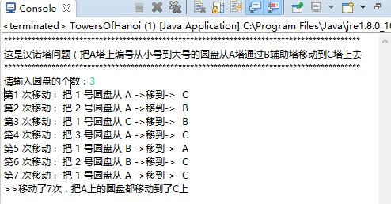

<!--more-->

## 起源

汉诺塔（又称河内塔）问题是源于印度一个古老传说的益智玩具。大梵天创造世界的时候做了三根金刚石柱子，在一根柱子上从下往上按照大小顺序摞着64片黄金圆盘。大梵天命令婆罗门把圆盘从下面开始按大小顺序重新摆放在另一根柱子上。并且规定，在小圆盘上不能放大圆盘，在三根柱子之间一次只能移动一个圆盘。

## 抽象为数学问题

如下图所示，从左到右有A、B、C三根柱子，其中A柱子上面有从小叠到大的n个圆盘，现要求将A柱子上的圆盘移到C柱子上去，期间只有一个原则：一次只能移到一个盘子且大盘子不能在小盘子上面，求移动的步骤和移动的次数


解:
(1)  n == 1

>  **第1次  1号盘  A---->C       sum = 1 次**

(2)  n == 2
>  第1次  1号盘  A---->B
>​  **第2次  2号盘  A---->C**
>​  第3次  1号盘  B---->C        sum = 3 次

（3）n == 3
>  第1次  1号盘  A---->C
>​  第2次  2号盘  A---->B
>​  第3次  1号盘  C---->B
>​  **第4次  3号盘  A---->C**
>​  第5次  1号盘  B---->A
>​  第6次  2号盘  B---->C
>​  第7次  1号盘  A---->C        sum = 7 次

不难发现规律：
>  1个圆盘的次数 2的1次方减1
>​  2个圆盘的次数 2的2次方减1
>​  3个圆盘的次数 2的3次方减1
>​   。  。   。    。   。 
>​  n个圆盘的次数 2的n次方减1

 故：移动次数为：2^n - 1

## 调用方法的栈机制（特点：先进后出）

从主线程开始调用方法（函数）进行不停的压栈和出栈操作，函数的调用就是将函数压如栈中，函数的结束就是函数出栈的过程，这样就保证了方法调用的顺序流，即当函数出现多层嵌套时，需要从外到内一层层把函数压入栈中，最后栈顶的函数先执行结束（最内层的函数先执行结束）后出栈，再倒数第二层的函数执行结束出栈，到最后，第一个进栈的函数调用结束后从栈中弹出回到主线程，并且结束。

## 算法分析（递归算法）

我们在利用计算机求汉诺塔问题时，必不可少的一步是对整个实现求解进行算法分析。到目前为止，求解汉诺塔问题最简单的算法还是同过递归来求，至于是什么是递归，递归实现的机制是什么，我们说的简单点就是自己是一个方法或者说是函数，但是在自己这个函数里有调用自己这个函数的语句，而这个调用怎么才能调用结束呢？，这里还必须有一个结束点，或者具体的说是在调用到某一次后函数能返回一个确定的值，接着倒数第二个就能返回一个确定的值，一直到第一次调用的这个函数能返回一个确定的值。
  实现这个算法可以简单分为三个步骤：
>（1）     把n-1个盘子由A 移到 B；
>（2）     把第n个盘子由 A移到 C；
>（3）     把n-1个盘子由B 移到 C；

从这里入手，在加上上面数学问题解法的分析，我们不难发现，移到的步数必定为奇数步：

>（1）中间的一步是把最大的一个盘子由A移到C上去；
>（2）中间一步之上可以看成把A上n-1个盘子通过借助辅助塔（C塔）移到了B上，
>（3）中间一步之下可以看成把B上n-1个盘子通过借助辅助塔（A塔）移到了C上；

## java源代码

```java
package demo;
/**
 * 目的：实现汉诺塔问题求解
 * 作者：Dmego  时间：2016-10-15
 */
import java.util.Scanner;

public class TowersOfHanoi {
    static int m =0;//标记移动次数
    //实现移动的函数
    public static void move(int disks,char N,char M)
    {
        System.out.println("第" + (++m) +" 次移动 : " +" 把 "+ disks+" 号圆盘从 " + N +" ->移到->  " + M);
    }
    //递归实现汉诺塔的函数
    public static void hanoi(int n,char A,char B,char C)
    {
        if(n == 1)//圆盘只有一个时，只需将其从A塔移到C塔
            TowersOfHanoi.move(1, A, C);//将编b号为1的圆盘从A移到C
        else
        {//否则
            hanoi(n - 1, A, C, B);//递归，把A塔上编号1~n-1的圆盘移到B上，以C为辅助塔
            TowersOfHanoi.move(n, A, C);//把A塔上编号为n的圆盘移到C上
            hanoi(n - 1, B, A, C);//递归，把B塔上编号1~n-1的圆盘移到C上，以A为辅助塔
        }
    }
    public static void main(String[] args) {
        Scanner imput = new Scanner(System.in);
        char A = 'A';
        char B = 'B';
        char C = 'C';
        System.out.println("******************************************************************************************");
        System.out.println("这是汉诺塔问题（把A塔上编号从小号到大号的圆盘从A塔通过B辅助塔移动到C塔上去");
        System.out.println("******************************************************************************************");
        System.out.print("请输入圆盘的个数：");
        int disks = imput.nextInt();
        TowersOfHanoi.hanoi(disks, A, B, C);
        System.out.println(">>移动了" + m + "次，把A上的圆盘都移动到了C上");
        imput.close();
    }

}
```

## 图解程序运行流程

>（1）函数hanoi(int n,char A,char B,char C)的功能是把编号为n的圆盘借助B从A移动到 C上。
>（2）函数move(int n ,char N ,char M)的功能是把1编号为n的圆盘从N 移到M上


## 程序运行截图


