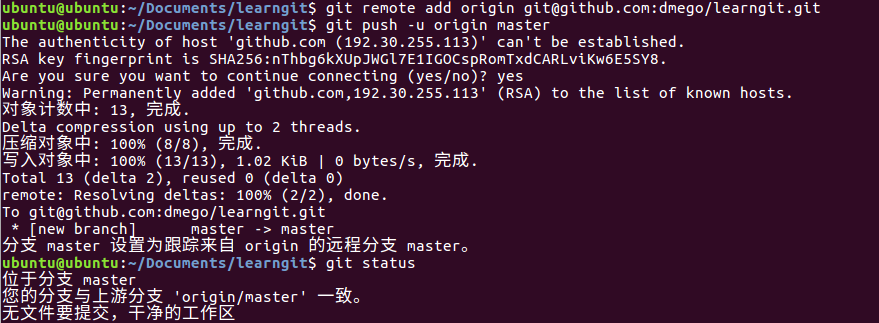
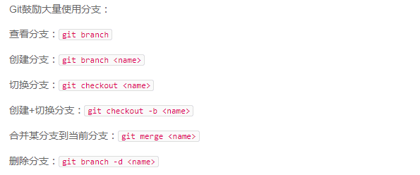
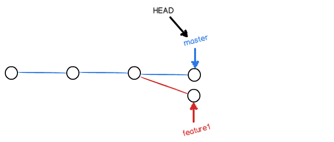
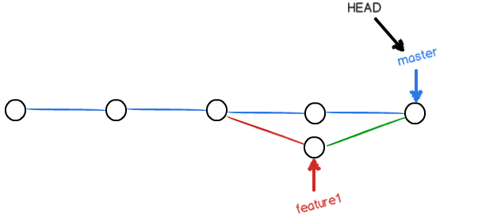
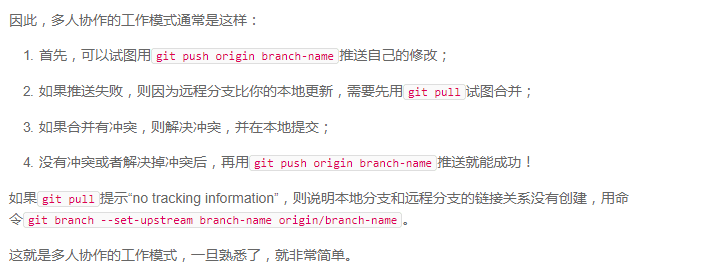
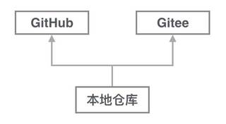

<!--more-->

## 前言

- 本文档笔记是本人通过学习[廖雪峰Git教程](https://www.liaoxuefeng.com/wiki/0013739516305929606dd18361248578c67b8067c8c017b000)的整理而来

- 本文档主要记录本人当时在学习过程中认为重要的概念和命令

## 创建一个版本库

```bash
mkdir learngit //使用命令创建一个目录
cd learngit //进入这个目录
pwd //用于显示当前目录
```

## 初始化仓库

```bash
git init
```

## 添加文件到仓库

```bash
第一步：git add <file>
第二步：git commit -m '本次提交的说明'
```

```bash
git status:查看当前Git仓库的状态，是否有文件没有提交，让我们掌握仓库最新的状态
git diff: 查看不同，当修改文件后，可以查看修改了什么内容（只适用于文本文件）
```


## 实现版本之间回退

```bash
git log:显示从最近到最远的提交日志
git log --pretty=oneline:如果信息太多，使用这行命令
```

1. 在Git中，用`HEAD`表示当前版本,上一个版本就是`HEAD^`，上一个版本就是`HEAD^^`，当然往上100个版本写100个`^`比较容易数不过来，所以写成`HEAD~100`。
2. 一大串类似`882e1e0...67hko896`的是commit id 版本号
3. `git reset --hard HEAD^`: 回退到上一个版本此时，当再次使用`git log`命令时，发现之前的版本已经消失了，此时想要再次回到那个版本，有两种方式：一种是当命令窗口没有关闭时，找到那个版本的版本号，如：`81ac3c5`，此时又回到最新的那个版本的命令是：

```bash
git reset --hard 81ac3c5
```

如果已经过去很久了，已经记不得想要回退的版本的ID号，此时可以依据这个命令来找回版本号：

```bash
git reflog
```


## 工作区与暂存区的概念

1. 工作区（Working Directory）：就是能在电脑上看到的目录，比如仓库文件夹

2. 版本库（Repository）：工作区里有一个隐藏目录`.git` ，这个不算工作区，而是git的版本库前面我们讲了往Git版本库里添加文件的时候，分两步，这两步更详细的说是：

- 第一步使用`git add` 把文件添加进去，实际上就是把文件修改添加到暂存区；
- 第二步使用`git commit`提交修改，实际上是把暂存区的所有内容提交到当前分支因为我们创建Git版本库的时候，Git自动为我们创建了唯一的一个`master` 分支，而`git commit`就是往 `master`分支上提交更改。也可以简单理解为需要提交的文件修改通通放到了暂存区，等到要提交的时候，一次性提交暂存区里所有的文件到分支。

**注意点**：

> `git diff` 是工作区与暂存区的对比
> `git diff -- cached` 是暂存区与分支的对比
> `git diff HEAD -- <file>` 是工作区与分支的对比

## 撤销修改

*在以下三种情况下可以撤销修改：*

1. 修改了文件，没有添加到暂存区（修改了工作区）`git checkout -- <file>`
2. 修改文件后添加到了暂存区，但是没有提交到分支（修改了暂存区）`git reset HEAD <file>`  //把暂存区的修改回退到工作区`git checkout -- <file>`//把工作区的修改撤销
3. 已经提交到了本地仓库分支，没有同步到远程仓库（版本回退即可）`git reset --hard HEAD^`

## 删除文件以及恢复文件

当我们使用 `rm` 命令或者直接在图形界面删除文件后，只是修改了工作区，若先使用 `git rm <file>` 命令删除文件，此时不仅修改了工作区，还修改了暂存区，此时使用撤销修改的命令还能找回被删除的文件。当删除操作被提交到分支后，只能使用版本回退操作来找回删除的文件。

**注**：`git rm <file>` 命令相当于先执行了`rm`命令 ，然后把工作区的修改添加到了暂存区，也就是说使用` git rm <file> `命令后不仅工作区的文件被删除了，也把删除操作添加到了暂存区。这就告诉我们，要想快速删除文件并提交到分支，只需执行` git rm <file>` 命令后` commit `就行了，如果想要更加谨慎，可以先使用` rm` 命令删除工作区中的文件，此时若想要撤销删除可以使用` git checkout -- <file>` 命令；如果想要添加修改操作到暂存区，使用`git rm <file>` 命令，到了这一步如果想要撤销删除可以先使用`git reset HEAD <file>` 命令撤销对暂存区的修改，然后使用 `git checkout -- <file>`命令来撤销对工作区的修改；如果已经把修改操作提交到了分支，此时想要撤销删除，找回文件则只能使用版本回退操作，即使用`git reset --hard HEAD^`命令。

## 添加远程库，并保持同步

1. 当我们的系统之前从未使用SSH进行加密传输操作时，我们应该首先在用户主目录下创建SSH Key，因为你的本地Git 仓库和GitHub 仓库之间的传输是通过SSH 加密的。
    
2. 在Github 上创建一个和本地仓库同名的仓库，要让本地仓库与该远程仓库关联可以使用命令：

```bash
git remote add origin git@server-name:path/repo-name.git
```

3. 关联后，使用命令`git push -u origin master`第一次推送`master` 分支的所有内容

例如：


4. 此后，每次本地提交后，要想实现远程仓库的同步，只需使用命令`git push origin master`推送最新的修改

## 从远程仓库克隆

在合适的目录下使用命令

```bash
git clone git@server-name:path/repo-name.git
```

例如:


## 创建与合并分支

1. 创建一个名为`dev`的分支

```bash
git branch dev
```

2. 切换到`dev`分支

```bash
git checkout dev
```

3. 以上两步可以用一条下面的命令完成

```bash
git checkout -b dev //加上-b 参数表示创建并切
```

4. 查看分支情况

```bash
git branch //这个命令会列出所有的分支，并且在当前分支上会标注星号*
```

5. 把`dev`分支的工作合并分支`master`上

```bash
git checkout master //首先切换到master分支git merge dev //合并指定分支（dev）到当前分支（master）
```

6. 删除分支

```bash
git branch -d dev //删除分支 dev
```




## 分支合并时冲突解决

当我们在两个分支上对同一个文件进行修改，并且修改的内容不一样，此时合并这两个分支时就会产生冲突

此时查看该修改的文件时，就会发现Git用`<<<<<<<`，`=======`，`>>>>>>>`标记出不同分支的内容，此时我们需要手动修改文件，删除Git的标记，然后将修改后的文件先添加到暂存区，然后提交到分支

提交成功后使用命令：`git log --graph --pretty=oneline --abbrev-commit`可以看到分支合并图

## 分支管理策略

通常，合并分支的时候，Git会使用` Fast forward `模式，当是在这种模式下删除分支后就会丢掉分支的信息，如果我们想要在删除分支后还想在分支历史上看到分支的信息就可以强制禁用` Fast forward` 模式，此时Git 会在合并分支时生成一个新的`commit`：强制禁用` Fast forward` 模式的命令：

```bash
git merge --no-ff -m 'merge with no-ff' dev //因为本次合并会生成一个commit ，所以需要加上 -m 参数说明
```


## 保存现场，修复bug后恢复

我们在开发过程中需要经常修复软件中发现的bug，在git中我们就可以通过创建一个临时的分支来修复bug，修复bug后合并分支，然后删除临时分支  
但是如果我们在`dev`分支上的内容还没提交怎么办，此时我们可以使用命令来保存现场：

```bash
git stash
```

此时再查看Git库的状态就是干净的。当我们在`master`分支上通过创建临时分支修复bug后，再`checkout` 回`dev`分支时，我们有两条命令都可以恢复修复bug之前`dev`分支的状态：

```bash
（1）git stash apply // 恢复工作现场，但是不删除现场，就是说以后还可以恢复到该状态
（2）git stash pop // 恢复工作现场后删除stash的内容
```

我们可以使用命令`git stash list` 来查看有多少现场被保存了，我们也可以多次使用`stash`，恢复的时候，通过 `list `后查看`stash` 的值， 然后通过恢复现场的命令来选择回到具体哪一个现场，如：

```bash
(1) git stash apply stash@{1}  //恢复到 stash@{1} 后不删除该现场
(2) git stash pop stash@{0} //恢复到 stash@{0} 后删除该现场
```

## 强行删除没有完全合并的分支

当我们要添加一个新功能时我们会新建一个分支来进行添加，等到要合并新功能的分支到主分支时，接到通知说该新功能不需要了，此时如果我们删除该新功能分支会提示我们该新功能分支没有完全合并，如果确认要删除它，执行：`git branch -D <分支名称>`使用这个命令就可以删除未合并的分支，其实就是将小写 `d` 换成大写`D`

## 多人协作开发

我们一般在开发中都是多人协作开发项目的,当你`clone`你的另一名小伙伴的项目库到你电脑上后，默认你只能看到该项目的本地`master`分支，你如果想要在`dev`分支上开发，就必须创建远程`origin`的`dev`分支到本地来，使用的命令是：

```bash
git checkout -b dev origin/dev
```

这样你就可以继续在`dev`上修改，修改完之后还可以 `push dev`分支到远程库，但是如果你的小伙伴也` push `了一次到远程库，并且此时你和你的小伙伴都对同样的文件进行了修改，你现在试图推送该分支到远程库，结果出现
 
推送失败，因为你的提交与你小伙伴的最新提交之间有冲突。此时根据提示我们先用`git pull `把最新的提交从 `origin/dev`抓取下来，然后在本地合并解决冲突后然后提交分支并且推送`dev`到远程库。有的时候，我们`git pull`也会失败，原因是因为没有指定本地 `dev` 分支与远程`origin/dev` 分支的链接。我们根据提示，设置链接
  设置的命令如提示:

```bash
git branch --set-upstream-to=origin/dev
```

此时就可以`git pull` 了，但是在本地合并时还会有冲突，此时我们通过手动解决冲突后然后推送到远程库。


**小结**：

- 查看远程库的信息，使用命令`git remote -v`
- 本地新建的分支如果不推送到远程对其他人是不可见的
- 在本地创建和远程分支对应的分支使用`git checkout -b branch-name origin/branch-name` 本地和远程分支的名称最好一致

## 创建和操作标签

为了更加方便的操作不同的版本，使用`commit`号（如：`fs3k1hgk`）是非常不方便的，如果使用版本号如`v 1.2`等标号就能很快的确认一个版本.
标签：`tag`就是一个让人容易记住的有意义的名字，它跟某一个`commit` 绑在一起。它可以类似的理解为 IP 与域名的关系.

1. 使用如下命令用于新建一个标签，默认为`HEAD`，也可以指定一个`commit id`

```bash
git tag <tagname>
如：git tag v1.0
git tag <tagname> <commit id>
如：git tag v1.0 ew326gd | git tag v 1.0 HEAD@{1}
```


*注:    标签不是按时间顺序列出，而是按字母排序的。可以用`git show <tagname>`查看标签信息*

2. 删除一个本地标签`git tag -d <tagname>`
3. 推送一个本地标签到远程库`git push origin <tagname>`
4. 推送全部未推送到远程库的标签到远程库`git push origin --tags`
5. 删除一个已经推送到远程库的标签

```bash
git tag -d <tagname> //先删除本地标签
git push origin:refs/tags/<tagname> // 再删除远程标签
```

## 一个本地库关联多个远程库

由于git本身是分布式版本控制系统，可以同步多个不同的远程库。例如可以同时同步到GitHUb和码云，但是我们在使用多个远程库时要注意，因为git给远程库起的默认名称是`origin`，如果有多个远程库，我们就需要使用不同的名称来标识不同的远程库。
一般关联多个远程库分为下面几个步骤：

1. 如果之前关联过一个远程库，且远程库的名称是默认的`origin`，此时你可以继续保留这个库或者先删除这个库，然后再关联并且起一个更加有辨识度的名称

```bash
git remote rm origin //删除已经关联的名为origin 的远程库
```

2. 接着再关联如GitHub上的远程库，并将远程库的名称叫做 GitHub,不使用默认的名称

```bash
git remote add github git@github.com:dmego/learngit.git
```

3. 然后再关联一个远程仓库，如码云上的远程库，并将远程库的名称叫做gitee 

```bash
git remote add gitee git@gitee.com:dmocgo/learngit.git
```

4. 现在，我们用`git remote -v`查看远程库信息，可以看到两个远程库：

```bash
git remote -v
gitee git@gitee.com:dmocgo/learngit.git (fetch)
gitee git@gitee.com:dmocgo/learngit.git (push)
github git@github.com:dmego/learngit.git (fetch)
github git@github.com:dmego/learngit.git (push)
```

5. 如果要推送到GitHub，使用命令：

```bash
git push github master
```

```bash
6. 如果要推送到码云，使用命令：
```

```bash
git push gitee master
```

这样一来，我们的本地库就可以同时与多个远程库同步


## 自定义Git

1. 让Git命令显示颜色，输出更加醒目：

```bash
git config --global color.ui true
```

2. 忽略特殊的文件，其中忽略文件的原则是：

>忽略操作系统自动生成的文件，如缩略图
>忽略编译生成的中间文件，可执行文件，也就是说一个文件时通过其他文件自动生成的就没有必要放进版本库了，例如java编译产生的`.class` 文件
>忽略带有敏感信息的配置文件，比如保存了数据库密码的配置文件

我们在Git工作区的根目录下创建一个特殊的 `.gitignore`文件，然后把要忽略的文件名写进去，Git就会每次在提交的时候自动忽略这些文件，我们不需要从头写一个`.gitignore`文件，GitHub已经为我们准备了各种配置文件，所有的配置文件都可以在线浏览：https://github.com/github/gitignore。
 	有的时候，你想添加一个文件到git ，但是却发现添加不了，原因可能是这个文件被忽略了，如果想强制添加可以使用命令：

```bash
git add -f <filename>
```

还有的时候发现可能是 `.gitignore`文件写错了，需要找出来到底哪个规则写错了，可以使用命令检查：

```bash
git check-ignore -v <filename>
```

3. 配置别名，简化命令。有时候命令太长或者单词不好记就可以使用Git来配置别名来达到高效的目的，例如将命令`git status`简化为`git st`:

```bash
git config --global alias.st status

```

**注意**：
`--global` 参数是全局参数，也就是这些命令在这台电脑的所有Git 仓库下都可以使用（是针对当前用户起作用），如果不加这个参数，就只能对当前仓库起作用。
每个仓库的配置文件都放在`.git/config` 文件中，其中别名就在 `[alias]` 后面，要想删除别名直接把对应的那行删除就行了
而每个用户的配置文件放在用户主目录下的一个隐藏文件`.gitconfig`中。其中别名就在 `[alias]`后面，要想删除别名直接把对应的那行删除就行了。

## 搭建Git服务器

教程地址：[廖雪峰GIt教程](http://www.liaoxuefeng.com/wiki/0013739516305929606dd18361248578c67b8067c8c017b000/00137583770360579bc4b458f044ce7afed3df579123eca000)