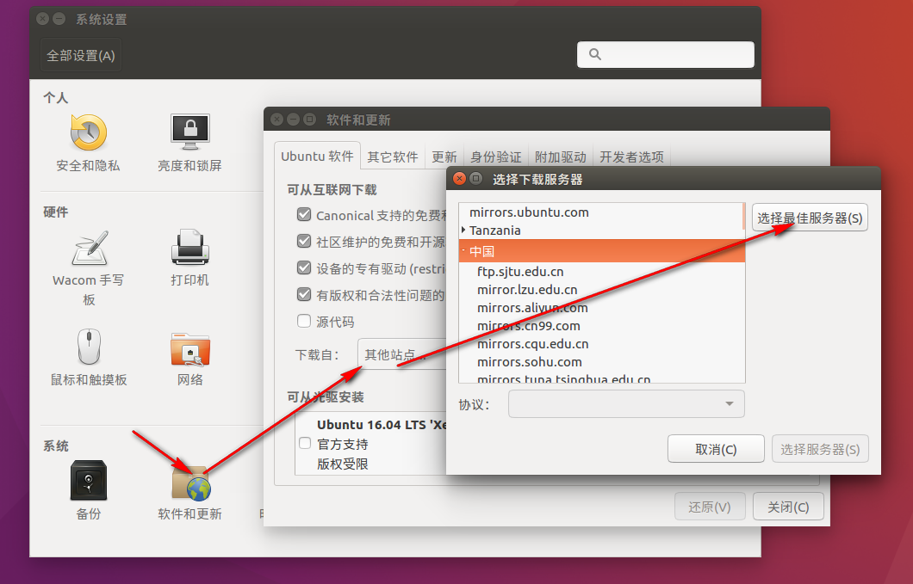
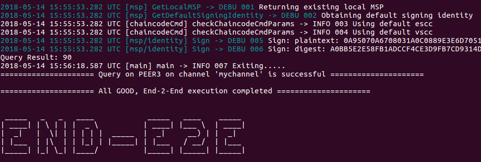
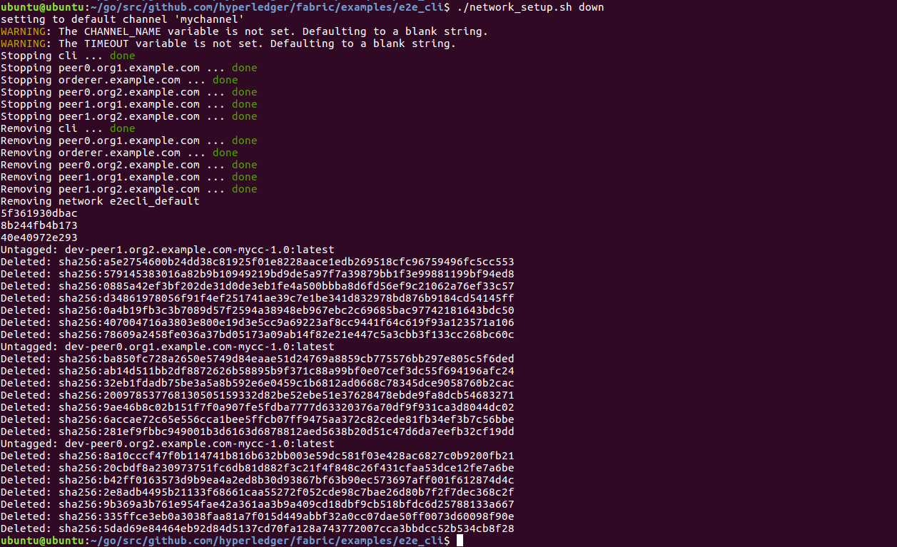

<!--more -->

<center>

</center>


## 前言

最近在参加一个比赛,使用到了区块链的开源软件`hyperledger`,由于之前从未接触过区块链,以及和区块链开发相关的内容,所有在网上查阅了大量的资料,并且通过学习[yeasy(杨宝华)](http://yeasy.github.io/)开源的入门书籍[区块链技术指南](https://github.com/yeasy/blockchain_guide)以及进阶学习的《区块链原理、设计与应用》,对区块链的一些相关概念有了一定认识。这里记录的是我安装`hyperledger fabric`的所有步骤，同时也是一个快速搭建单机环境的参考教程。

## 准备好机器环境

本人的区块链网络部署在`VMware`搭建的ubuntu16.04的环境下（推荐使用该版本的系统），详细的系统版本为`ubuntu-16.04.4-desktop-amd64.iso  `,是从[网易开源镜像站](http://mirrors.163.com/ubuntu-releases/16.04/)下载的。对于如何使用`VMware`安装虚拟机以及让虚拟机访问网络，网上有许多教程，这里就不重复讲了。


当将系统安装完成后，需要更换源，使用`desktop`版的可以直接在设置里面选择最佳服务器,如下图所示

若使用的是服务器版本,则可以使用如下命令换成高速的源

- 先备份原来的源文件

```bash
sudo cp /etc/apt/sources.list /etc/apt/sources.list.bak  
```

- 打开sources.list文件,删除原来的内容

```bash
sudo vim /etc/apt/sources.list
```

- 任选下面一组源文件复制到sources.list中

>网易源

```bash
    deb http://mirrors.163.com/ubuntu/ trusty main restricted universe multiverse  
    deb http://mirrors.163.com/ubuntu/ trusty-security main restricted universe multiverse  
    deb http://mirrors.163.com/ubuntu/ trusty-updates main restricted universe multiverse  
    deb http://mirrors.163.com/ubuntu/ trusty-proposed main restricted universe multiverse  
    deb http://mirrors.163.com/ubuntu/ trusty-backports main restricted universe multiverse  
    deb-src http://mirrors.163.com/ubuntu/ trusty main restricted universe multiverse  
    deb-src http://mirrors.163.com/ubuntu/ trusty-security main restricted universe multiverse  
    deb-src http://mirrors.163.com/ubuntu/ trusty-updates main restricted universe multiverse  
    deb-src http://mirrors.163.com/ubuntu/ trusty-proposed main restricted universe multiverse  
    deb-src http://mirrors.163.com/ubuntu/ trusty-backports main restricted universe multiverse  
```

>阿里源

```bash
# deb cdrom:[Ubuntu 16.04 LTS _Xenial Xerus_ - Release amd64 (20160420.1)]/ xenial main restricted  
deb-src http://archive.ubuntu.com/ubuntu xenial main restricted #Added by software-properties  
deb http://mirrors.aliyun.com/ubuntu/ xenial main restricted  
deb-src http://mirrors.aliyun.com/ubuntu/ xenial main restricted multiverse universe #Added by software-properties  
deb http://mirrors.aliyun.com/ubuntu/ xenial-updates main restricted  
deb-src http://mirrors.aliyun.com/ubuntu/ xenial-updates main restricted multiverse universe #Added by software-properties  
deb http://mirrors.aliyun.com/ubuntu/ xenial universe  
deb http://mirrors.aliyun.com/ubuntu/ xenial-updates universe  
deb http://mirrors.aliyun.com/ubuntu/ xenial multiverse  
deb http://mirrors.aliyun.com/ubuntu/ xenial-updates multiverse  
deb http://mirrors.aliyun.com/ubuntu/ xenial-backports main restricted universe multiverse  
deb-src http://mirrors.aliyun.com/ubuntu/ xenial-backports main restricted universe multiverse #Added by software-properties  
deb http://archive.canonical.com/ubuntu xenial partner  
deb-src http://archive.canonical.com/ubuntu xenial partner  
deb http://mirrors.aliyun.com/ubuntu/ xenial-security main restricted  
deb-src http://mirrors.aliyun.com/ubuntu/ xenial-security main restricted multiverse universe #Added by software-properties  
deb http://mirrors.aliyun.com/ubuntu/ xenial-security universe  
deb http://mirrors.aliyun.com/ubuntu/ xenial-security multiverse  
```

>搜狐源

```bash
deb http://mirrors.sohu.com/ubuntu/ trusty main restricted universe multiverse  
deb http://mirrors.sohu.com/ubuntu/ trusty-security main restricted universe multiverse  
deb http://mirrors.sohu.com/ubuntu/ trusty-updates main restricted universe multiverse  
deb http://mirrors.sohu.com/ubuntu/ trusty-proposed main restricted universe multiverse  
deb http://mirrors.sohu.com/ubuntu/ trusty-backports main restricted universe multiverse  
deb-src http://mirrors.sohu.com/ubuntu/ trusty main restricted universe multiverse  
deb-src http://mirrors.sohu.com/ubuntu/ trusty-security main restricted universe multiverse  
deb-src http://mirrors.sohu.com/ubuntu/ trusty-updates main restricted universe multiverse  
deb-src http://mirrors.sohu.com/ubuntu/ trusty-proposed main restricted universe multiverse  
deb-src http://mirrors.sohu.com/ubuntu/ trusty-backports main restricted universe multiverse

```

复制进去后,使用`:wq`保存,然后使用如下命令更新一下

```bash
sudo apt-get install update
```

执行完成后环境就基本上准备好了,如果使用的是服务器版本,觉得使用不方便的话,可以使用`xshell`之类的远程连接工具连接你的虚拟机。如果你的环境搭建再云服务器上，例如阿里云或者腾讯云，可以不用更新源，直接在自己的主机上使用远程连接工具连接上云主机，环境就算完成了（若在本地不能连接上云主机，或者虚拟机，检查一下`ssh`是否已经安装并启动,若没有，可以参加网上的教程，配置远程连接）。

## 安装GO语言环境

不推荐使用`apt`的方式安装GO,原因是这样安装的版本比较老，推荐安装最新版的GO,具体安装命令如下

- 下载最新的GO安装包，具体的最新版本号可以从[Golang官网](https://golang.org/)上查看

```bash
wegt https://dl.google.com/go/go1.10.2.linux-amd64.tar.gz
```

- 解压安装包到`/usr/local`目录下

```bash
sudo tar -C /usr/local -xzf go1.10.2.linux-amd64.tar.gz
```

- 编辑当前用户的环境变量

```bash
vim ~/.profile
```

添加如下内容

```bash
export PATH=$PATH:/usr/local/go/bin
export GOROOT=/usr/local/go
#这里配置的GOPATH目录为家目录的的go文件夹
export GOPATH=$HOME/go
export PATH=$PATH:$HOME/go/bin
```

使用`:wq`保存后使用如下命令将保存立即刷新

```bash
source ~/.profile
```

- 建立`GOPATH`目录
由于在环境变量中配置了`GOPATH`目录的位置，所以我们需要在家目录下创建该文件夹

```bash
cd ~
mkdir go
```

- 查看go版本，测试环境配置是否成功

```bash
$ go version
go version go1.10 linux/amd64
```

## 安装Docker

这里使用的`Docker`的[官方文档](https://docs.docker.com/install/linux/docker-ce/ubuntu/)来安装docker

- 如果系统中有旧版本的`Docker`,需要先使用如下命令卸载

```bash
$ sudo apt-get remove docker docker-engine docker.io
```

- 更新`apt`包索引

```bash
sudo apt-get update
```

- 安装软件包以允许`apt`通过HTTPS使用远程库

```bash
sudo apt-get install \
    apt-transport-https \
    ca-certificates \
    curl \
    software-properties-common
```

若出现无法识别命令，可以先将该命令复制到一个文本文件中，将`\`去掉，将所有语句放在同一行下，然后复制执行。

- 添加`Docker`的官方`GPG`密钥

```bash
$ curl -fsSL https://download.docker.com/linux/ubuntu/gpg | sudo apt-key add -
```

- 通过搜索指纹的最后8个字符，确认您现在拥有指纹识别码`9DC8 5822 9FC7 DD38 854A E2D8 8D81 803C 0EBF CD88`

```bash
$ sudo apt-key fingerprint 0EBFCD88

pub   4096R/0EBFCD88 2017-02-22
      Key fingerprint = 9DC8 5822 9FC7 DD38 854A  E2D8 8D81 803C 0EBF CD88
uid                  Docker Release (CE deb) <docker@docker.com>
sub   4096R/F273FCD8 2017-02-22
```

- 使用以下命令设置稳定版本的远程库

```bash
$ sudo add-apt-repository \
   "deb [arch=amd64] https://download.docker.com/linux/ubuntu \
   $(lsb_release -cs) \
   stable"
```

- 再次更新`apt`包索引

```bash
sudo apt-get update
```

- 使用`apt`安装`docker-ce`

```bash
sudo apt-get install docker-ce
```

- 查看docker版本，测试环境配置是否成功

```bash
$ docker version
Client:
 Version:      18.03.1-ce
 API version:  1.37
 Go version:   go1.9.5
 Git commit:   9ee9f40
 Built:        Thu Apr 26 07:17:20 2018
 OS/Arch:      linux/amd64
 Experimental: false
 Orchestrator: swarm

Server:
 Engine:
  Version:      18.03.1-ce
  API version:  1.37 (minimum version 1.12)
  Go version:   go1.9.5
  Git commit:   9ee9f40
  Built:        Thu Apr 26 07:15:30 2018
  OS/Arch:      linux/amd64
  Experimental: false
```
安装完成之后，需要将当前用户添加到`docker`用户组，然后为该用户添加`sudo`权限

- 若没有创建`docker`用户组，可以使用如下命令创建一个`GID`为`999`，组名为`docker`的用户组

```bash
sudo groupadd –g 999 docker
```

- 将当前用户(ubuntu)添加到`docker`用户组并分配`sudo`权限

```bash
sudo usermod -aG docker ubuntu
```

注销后重新登录，然后添加阿里云的Docker Hub镜像（注意，不同版本的添加方法不同，见[阿里云容器 Hub](https://dev.aliyun.com/list.html?namePrefix=docker)）

```bash
sudo mkdir -p /etc/docker
sudo tee /etc/docker/daemon.json <<-'EOF'
{
    "registry-mirrors": ["https://obou6wyb.mirror.aliyuncs.com"]
}
EOF
$ sudo systemctl daemon-reload
$ sudo systemctl restart docker
```

如果觉得阿里云镜像不好用，可以选择DaoClound的镜像,配置方式见[DaoCloud官方文档](http://guide.daocloud.io/dcs/daocloud-9153151.html)

## 安装Docker-Compose

 `Docker-Compose`是支持通过模板脚本批量创建的一个组件。在安装 `Docker-Compose`之前，需要安装`python-pip`

- 安装`python-pip`

```bash
sudo apt-get python-pip
```
- 下载 `Docker-Compose`，这里使用的是国内的DaoClound加速器进行下载```bash

curl -L https://get.daocloud.io/docker/compose/releases/download/1.12.0/docker-compose-`uname -s`-`uname -m` > ~/docker-compose
```

- 将`Docker-Compose`文件夹移动到`/usr/local/bin`目录下

​```bash
sudo mv ~/docker-compose /usr/local/bin/docker-compose 
```

- 为`Docker-Compose`附上可执行权限

```bash

chmod +x /usr/local/bin/docker-compose
```

## 下载Fabric源码

- 先在`GOPATH`下创建对应的目录

```bash
$ mkdir -p ~/go/src/github.com/hyperledger
```

- 切换到对应目录，使用`Git`命令将`fabric`的源码从github上克隆下来

```bash
cd ~/go/src/github.com/hyperledgergit clone https://github.com/hyperledger/fabric.git
```
- 由于Fabric一直在更新，而我们并不需要使用最新的源码，所有将版本切换到`v1.0.0`

```bash
$ cd ~/go/src/github.com/hyperledger/fabric
git checkout v1.0.0
```

## 下载Fabric Docker镜像

由于刚才设置了Docker Hub镜像的地址，并且官方文件中也提供了批量下载的脚本，所有我们只需运行下面命令即可

```bash
$ cd ~/go/src/github.com/hyperledger/fabric/examples/e2e_cli/
$ source download-dockerimages.sh -c x86_64-1.0.0 -f x86_64-1.0.0
```

由于刚才设置的是国内的镜像站，在本地网速还不错的情况下下载数度还是很快的。当下载完成后，使用如下命令检查镜像列表

```bash
docker images
REPOSITORY                              TAG                 IMAGE ID            CREATED             SIZE
dev-peer0.org1.example.com-marbles-v4   latest              089d43e100c9        5 hours ago         173MB
dev-peer0.org1.example.com-fabcar-1.0   latest              6047921ee993        7 hours ago         173MB
hyperledger/fabric-tools                latest              0403fd1c72c7        10 months ago       1.32GB
hyperledger/fabric-tools                x86_64-1.0.0        0403fd1c72c7        10 months ago       1.32GB
hyperledger/fabric-couchdb              latest              2fbdbf3ab945        10 months ago       1.48GB
hyperledger/fabric-couchdb              x86_64-1.0.0        2fbdbf3ab945        10 months ago       1.48GB
hyperledger/fabric-kafka                latest              dbd3f94de4b5        10 months ago       1.3GB
hyperledger/fabric-kafka                x86_64-1.0.0        dbd3f94de4b5        10 months ago       1.3GB
hyperledger/fabric-zookeeper            latest              e545dbf1c6af        10 months ago       1.31GB
hyperledger/fabric-zookeeper            x86_64-1.0.0        e545dbf1c6af        10 months ago       1.31GB
hyperledger/fabric-orderer              latest              e317ca5638ba        10 months ago       179MB
hyperledger/fabric-orderer              x86_64-1.0.0        e317ca5638ba        10 months ago       179MB
hyperledger/fabric-peer                 latest              6830dcd7b9b5        10 months ago       182MB
hyperledger/fabric-peer                 x86_64-1.0.0        6830dcd7b9b5        10 months ago       182MB
hyperledger/fabric-javaenv              latest              8948126f0935        10 months ago       1.42GB
hyperledger/fabric-javaenv              x86_64-1.0.0        8948126f0935        10 months ago       1.42GB
hyperledger/fabric-ccenv                latest              7182c260a5ca        10 months ago       1.29GB
hyperledger/fabric-ccenv                x86_64-1.0.0        7182c260a5ca        10 months ago       1.29GB
hyperledger/fabric-ca                   latest              a15c59ecda5b        10 months ago       238MB
hyperledger/fabric-ca                   x86_64-1.0.0        a15c59ecda5b        10 months ago       238MB
hyperledger/fabric-baseos               x86_64-0.3.1        4b0cab202084        12 months ago       157MB
```

出现以上结果说明镜像已经下载成功

## 启动Fabric网络并运行e2e_cli项目

- 进入`e2e_cli`目录，并执行启动命令

```bash
$ cd ~/go/src/github.com/hyperledger/fabric/examples/e2e_cli/
$ ./network_setup.sh up
```

这个过程做了如下操作
>1.编译生成`Fabric`公私钥，证书的程序，程序在目录：`fabric/release/linux-amd64/bin`下

>2.基于`configtx.yaml`生成创世区块和通道相关信息，并保存到`channel-artifacts`文件夹中

>3.基于`crypto-config.yaml`生成公私钥和证书信息，并保存在`crypto-config`文件夹中

>4.基于`docker-compose-cli.yaml`启动`1 Orderer + 4 Peer + 1 CLI`的`Fabric`容器

>5.在`CLI`启动的时候，会运行`srcipt/script.sh`文件，这个脚本文件包含了创建`Channel`,加入`Channel`，安装`Example02`,运行`Example02`等功能

最后运行完成，我们会看到如下截图，说明网络启动成功了


## 手动测试一下Fabric网络

我们以安装好的`Example02`进行测试,在官方例子中，`channel`的名字是`mychannel`,链码的名字是`mycc`,我们首先重新打开一个命令行，然后进入`CLI`，
- 输入以下命令即可

```bash
$ docker exec -it cli bash
```

- 运行以下命令可以查询`a`账户的余额

```bash
$ peer chaincode query -C mychannel -n mycc -c '{"Args":["query","a"]}'
```
查询结果如下图所示

可以看到`a`账户的余额现在是90

- 运行以下命令可以查询`b`账户的余额
```bash
$ peer chaincode query -C mychannel -n mycc -c '{"Args":["query","b"]}'
```
查询结果如下图所示

可以看到`b`账户的余额现在是210

- 现在将`b`账户的余额转100给`a`账户，运行如下命令

```bash
peer chaincode invoke -o orderer.example.com:7050  --tls true --cafile /opt/gopath/src/github.com/hyperledger/fabric/peer/crypto/ordererOrganizations/example.com/orderers/orderer.example.com/msp/tlscacerts/tlsca.example.com-cert.pem  -C mychannel -n mycc -c '{"Args":["invoke","b","a","100"]}'
```
执行结果如下图所示

可以看到执行成功了

- 再次查询`a`账户的余额
```bash
$ peer chaincode query -C mychannel -n mycc -c '{"Args":["query","a"]}'
```
查询结果如下图所示

可以看到`a`账户的余额现在是190,比之前多了100

- 再次查询`b`账户的余额
```bash
$ peer chaincode query -C mychannel -n mycc -c '{"Args":["query","b"]}'
```
查询结果如下图所示

可以看到`b`账户的余额现在是110,比之前少了100

调用链码一切正常

## 关闭区块链网络
- 退出`CLI`容器
```bash
root@4941e8bd4bd6:/opt/gopath/src/github.com/hyperledger/fabric/peer# exit
```
- 关闭Fabric网络
```bash
$ cd ~/go/src/github.com/hyperledger/fabric/examples/e2e_cli
$ ./network_setup.sh down
```
最后出现如下图说明关闭区块链网络成功


## 总结
至此，部署以及测试`fabric`的环境已经全部完成，下一篇博客我将记录如何在此基础上部署及运行IBM官方区块链例子[marbles(弹珠资产)](https://github.com/IBM-Blockchain/marbles)

## 参考
- [快速搭建一个Fabric 1.0的环境](http://www.cnblogs.com/studyzy/p/7437157.html)
- [Hyperledger Fabric 1.0 从零开始（五）——运行测试e2e](https://www.cnblogs.com/aberic/p/7532421.html) 
- [超级账本搭建流程fabric-sample first-network](https://segmentfault.com/a/1190000014221967)
